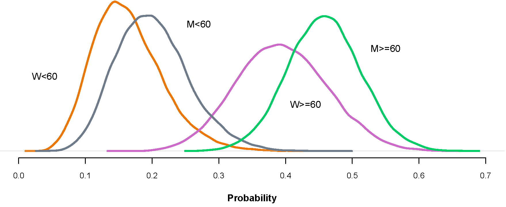

```{r setup, include=FALSE}
knitr::opts_chunk$set(echo = TRUE)

```


# Supplementary material for Section 4.1: Probabilities associated with direct transitions between states 

## From admission to the ICU or ward $W1$


We estimated the probability vector $\boldsymbol \theta_A=(\theta_{A\,W1}, \theta_{A\,I})'$ representing the probabilities that a patient admitted to the hospital is referred to ward $W1$ or to the ICU, respectively. A total of 1306 patients were admitted to the hospital, of whom 1208 were referred to ward $W1$ and 98 to the ICU. The posterior distribution of  $\boldsymbol \theta_A$  is the Dirichlet distribution
$$\pi( \boldsymbol \theta_A \mid \mathcal D)= \mbox{Di}(1208.5, 98.5).$$
 
\noindent -  The marginal  posterior distributions for each of the two probabilities are Beta distributions: $\pi(\theta_{A\,W1} \mid \mathcal{D})=\mbox{Be}(1208.5, \,98.5)$ and $\pi(\theta_{AI} \mid \mathcal{D})=\mbox{Be}(98.5, \,1208.5)$, respectively. The R code below produces the corresponding Beta posterior plots.

\noindent - The posterior means (95$\%$ credible intervals) for $\theta_{A\,W1}$ and $\theta_{A\,I}$ are 0.925 (0.910, 0.938) and 0.075 (0.062, 0.090)), respectively. 

\vspace*{0.2cm}

```{r, message=FALSE, warning=FALSE}
## R packages for all figures
library(ggplot2)
library(reshape)
library(latex2exp)

## -----------------------------------------------------------
## Figure 2 (in article):
## Posterior distributions for direct transition probabilities 
## from ADM to ICU (I) and Ward (W1)
## -----------------------------------------------------------
## Colors used: 
## * ICU: "chocolate"
## * W1:  "darkviolet" 

set.seed(1234)
provac1 <- data.frame(AI = rbeta(10000, 98.5, 1208.5),
                      AW1 = rbeta(10000, 1208.5, 98.5))
head(provac1, 3)

## Reshaping from wide format to long format
data1 <- melt(provac1)
head(data1, 3)
tail(data1, 3)

## Figure labels
labos <- list(expression(bold(theta[A~I])),
              expression(bold(theta[A~W1])))

## Density plots in Figure 1
library(dplyr)
library(tidyr)

ggplot(data1, aes(x = value, fill = variable)) +
  geom_density(color = NA, alpha = 0.8) +
  scale_x_continuous(limits = c(0, 1), expand = c(0, 0)) +
  ylim(0, 66.30909) +
  labs(x = expression(bold("Probability")),
       y = NULL) +
  theme(axis.line = element_line(color = "darkgray", size = 1.5),
        plot.background  = element_blank(),
        panel.grid.major = element_blank(),
        panel.grid.minor = element_blank(),
        axis.title.x = element_text(size = 20, face = "bold"),
        axis.text.x  = element_text(size = 16, face = "bold"),
        axis.text.y  = element_text(size = 16, face = "bold"),
        # Legend settings
        legend.justification = c(0.85, 1),
        legend.position = c(0.85, 1),
        legend.background = element_rect(fill = "gray90", color = NA),
        legend.text = element_text(size = 21, face = "bold"),
        legend.title = element_blank()) +
  scale_fill_manual(values=c("chocolate", "darkviolet"), labels = labos) 

```


## From ward $W1$ to ICU, death, home, or long-stay facility.

We estimated the probability vector $\boldsymbol{\theta}_{W1} = (\theta_{W1\,I}, \theta_{W1\,D}, \theta_{W1\,H}, \theta_{W1\,L})'$, representing the probabilities that a patient in ward $W1$ is transferred to the ICU ($I$), dies ($D$), is discharged home ($H$), or is referred to a long-term care facility ($L$), respectively. 

A total of 1208 patients were initially admitted to ward $W1$: among them, 82 were transferred to the ICU, 125 died, 946 were discharged home, and 55 were transferred to a long-term care facility. The posterior distribution of $\boldsymbol{\theta}_{W1}$ is the Dirichlet distribution
$$
\pi(\boldsymbol{\theta}_{W1} \mid \mathcal{D}) = \mathrm{Di}(82.25, 125.25, 946.25, 55.25).
$$

\noindent - The resulting marginal posterior distributions for each of the four probabilities are Beta distributions: 
$\pi(\theta_{W1\,I} \mid \mathcal{D}) = \mbox{Be}(82.25, 1126.75)$, 
$\pi(\theta_{W1\,D} \mid \mathcal{D}) = \mbox{Be}(125.25, 1083.75)$, 
$\pi(\theta_{W1\,H} \mid \mathcal{D}) = \mbox{Be}(946.25, 262.75)$, and 
$\pi(\theta_{W1\,L} \mid \mathcal{D}) = \mbox{Be}(55.25, 1153.75)$, respectively. 
The R code below produces the corresponding Beta posterior plots.

\noindent - The posterior means (95$\%$ credible intervals) for 
$\theta_{W1\,I}$, $\theta_{W1\,D}$, $\theta_{W1\,H}$, and $\theta_{W1\,L}$ 
are 0.068 (0.055, 0.083), 0.103 (0.087, 0.121), 0.783 (0.759, 0.806), and 0.046 (0.035, 0.058), respectively. 

\vspace*{0.2cm}

```{r, message=FALSE, warning=FALSE}
## ------------------------------------------------------------------
## Figure 3 (in article)
## Marginal posterior distributions for transition probabilities from
## Ward 1 (W1) to ICU (I), Home (H), Long term (LT), and Death (D)
## ------------------------------------------------------------------
## Colors used: 
## * ICU: "chocolate"
## * H:   "olivedrab" 
## * LT:  "steelblue3" 
## * D:   "brown2" 

set.seed(1234)
provac4 <- data.frame(W1I  = rbeta(10000, 82.25, 1126.75),
                      W1H  = rbeta(10000, 946.25, 262.75),
                      W1L = rbeta(10000, 55.25, 1153.75),
                      W1D  = rbeta(10000, 125.25, 1083.75))
head(provac4, 3)

## Reshaping from wide format to long format
data4 <- melt(provac4)
head(data4, 3)
tail(data4, 3)

## Figure labels
labos <- list(expression(bold(theta[W1~I])),
              expression(bold(theta[W1~H])),
              expression(bold(theta[W1~L])),
              expression(bold(theta[W1~D])))

## Maximum density
max_density <- data4 %>%  
  group_by(variable) %>%
  summarise(max_y = max(density(value)$y)) %>%
  pull(max_y) %>%
  max()

## Density plots in Figure 3
ggplot(data4, aes(x = value, fill = variable)) +
  geom_density(color = NA, alpha = 0.8) +
  scale_x_continuous(limits = c(0, 1), expand = c(0, 0)) +
  ylim(0, max_density * 1.0065) +
  labs(x = expression(bold("Probability")),
       y = NULL) +
  theme(axis.line = element_line(color = "darkgray", size = 1.5),
        plot.background  = element_blank(),
        panel.grid.major = element_blank(),
        panel.grid.minor = element_blank(),
        axis.title.x = element_text(size = 20, face = "bold"),
        axis.text.x  = element_text(size = 16, face = "bold"),
        axis.text.y  = element_text(size = 16, face = "bold"),
        # Legend settings
        legend.justification = c(1, 1),
        legend.position = c(1, 1),
        legend.background = element_rect(fill = "gray90", color = NA),
        legend.text = element_text(size = 21, face = "bold"),
        legend.title = element_blank()) +
  scale_fill_manual(values = c("chocolate", "olivedrab", "steelblue3", "brown2"), 
                    labels = labos)

```


## From ICU to death or to a second hospital ward, $W2$.


We estimated the probability vector $\boldsymbol{\theta}_I = (\theta_{I\,W2}, \theta_{I\,D})'$, representing the probabilities that a patient in the ICU is transferred to ward $W2$ ($W2$) or dies ($D$), respectively. Among the 180 patients admitted to the ICU, 35 died, and the remaining 145 were referred to ward $W2$. The posterior distribution of $\boldsymbol{\theta}_I$ is the Dirichlet distribution
$$
\pi(\boldsymbol{\theta}_I \mid \mathcal{D}) = \mathrm{Di}(145.50, 35.50).
$$

\noindent - The marginal posterior distributions for each probability are Beta distributions: $\pi(\theta_{I\,W2} \mid \mathcal{D}) = \mbox{Be}(145.50, 35.50)$ and $\pi(\theta_{I\,D} \mid \mathcal{D}) = \mbox{Be}(35.50, 145.50)$, respectively. The R code below produces the corresponding Beta posterior plots.

\noindent - The posterior means (95$\%$ credible intervals) for $\theta_{I\,W2}$ and $\theta_{I\,D}$ are 0.804 (0.743, 0.858) and 0.196 (0.142, 0.257), respectively. 

\vspace*{0.2cm}

```{r, message=FALSE, warning=FALSE}
## -------------------------------------------------------------
## Figure 4 (in article)
## Marginal posterior distributions for transition probabilities
## from ICU to Ward 2 (W2) and Death (D)
## -------------------------------------------------------------
## Colors used: 
## * D:  "brown2" 
## * W2: "darkgray" 

set.seed(1234)
provac2 <- data.frame(IW2 = rbeta(10000, 145.5, 35.5),
                      ID  = rbeta(10000, 35.5, 145.5))
head(provac2, 3)

## Reshaping from wide format to long format
data2 <- melt(provac2)
head(data2, 3)
tail(data2, 3)

## Figure labels
labos <- list(expression(bold(theta[I~W2])),
              expression(bold(theta[I~D])))

## Density plots in Figure 4
ggplot(data2, aes(x = value, fill = variable)) +
  geom_density(color = NA, alpha = 0.8) +
  scale_x_continuous(limits = c(0, 1), expand = c(0, 0)) +
  ylim(0, 66.30909) +
  labs(x = expression(bold("Probability")),
       y = NULL) +
  theme(axis.line = element_line(color = "darkgray", size = 1.5),
        plot.background  = element_blank(),
        panel.grid.major = element_blank(),
        panel.grid.minor = element_blank(),
        axis.title.x = element_text(size = 20, face = "bold"),
        axis.text.x  = element_text(size = 16, face = "bold"),
        axis.text.y  = element_text(size = 16, face = "bold"),
        # Legend settings
        legend.justification = c(1, 1),
        legend.position = c(1, 1),
        legend.background = element_rect(fill = "gray90", color = NA),
        legend.text = element_text(size = 21.25, face = "bold"),
        legend.title = element_blank()) +
  scale_fill_manual(values=c("darkgray", "brown2"), labels = labos) 

```


## From From ward $W2$ to death, home, or a long-term care facility.
          
We estimated the probability vector $\boldsymbol{\theta}_{W2} = (\theta_{W2\,D}, \theta_{W2\,H}, \theta_{W2\,L})'$, representing the probabilities that a patient in ward $W2$ dies ($D$), is discharged home ($H$), or is referred to a long-term care facility ($L$), respectively. 

Among the 145 patients admitted to ward $W2$, 15 died, 118 were discharged home, and the remaining 12 were transferred to a long-term care facility. The posterior distribution of $\boldsymbol{\theta}_{W2}$ is the Dirichlet distribution
$$
\pi(\boldsymbol{\theta}_{W2} \mid \mathcal{D}) = \mathrm{Di}(15.33, 118.33, 12.33).
$$

\noindent - The marginal posterior distributions for each probability are Beta distributions: $\pi(\theta_{W2\,D} \mid \mathcal{D}) = \mbox{Be}(15.33, 130.67)$, $\pi(\theta_{W2\,H} \mid \mathcal{D}) = \mbox{Be}(118.33, 157.67)$, and $\pi(\theta_{W2\,L} \mid \mathcal{D}) = \mbox{Be}(12.33, 263.67)$, respectively. The R code below produces the corresponding Beta posterior plots.

\noindent - The posterior means (95$\%$ credible intervals) for $\theta_{W2\,D}$, $\theta_{W2\,H}$, and $\theta_{W2\,L}$ are 0.105 (0.061, 0.159), 0.810 (0.743, 0.870), and 0.085 (0.045, 0.135), respectively. 

\vspace*{0.2cm}

```{r, message=FALSE, warning=FALSE}
## -------------------------------------------------------------
## Figure 5 (in article)
## Marginal posterior distributions for transition probabilities
## from Ward 2 (W2) to Home (H), Long term (LT) and Death (D)
## -------------------------------------------------------------
## Colors used: 
## * H:  "olivedrab" 
## * LT: "steelblue3" 
## * D:  "brown2" 

set.seed(1234)
provac3 <- data.frame(W2H  = rbeta(10000, 118.33, 27.67),
                      W2L = rbeta(10000, 12.33, 133.67),
                      W2D  = rbeta(10000, 15.33, 130.67))
head(provac3, 3)

## Reshaping from wide format to long format
data3 <- melt(provac3)
head(data3, 3)
tail(data3, 3)

## Figure labels
labos <- list(expression(bold(theta[W2~H])),
              expression(bold(theta[W2~L])),
              expression(bold(theta[W2~D])))

## Density plots in Figure 5
ggplot(data3, aes(x = value, fill = variable)) +
  geom_density(color = NA, alpha = 0.8) +
  scale_x_continuous(limits = c(0, 1), expand = c(0, 0)) +
  ylim(0, 66.30909) +
  labs(x = expression(bold("Probability")),
       y = NULL) +
  theme(axis.line = element_line(color = "darkgray", size = 1.5),
        plot.background  = element_blank(),
        panel.grid.major = element_blank(),
        panel.grid.minor = element_blank(),
        axis.title.x = element_text(size = 20, face = "bold"),
        axis.text.x  = element_text(size = 16, face = "bold"),
        axis.text.y  = element_text(size = 16, face = "bold"),
        # Legend settings
        legend.justification = c(1, 1),
        legend.position = c(1, 1),
        legend.background = element_rect(fill = "gray90", color = NA),
        legend.text = element_text(size = 20, face = "bold"),
        legend.title = element_blank()) +
  scale_fill_manual(values=c("olivedrab", "steelblue3", "brown2"), labels = labos) 

```

\newpage 

# Supplementary material for Section 4.2: Probability of leaving hospital on discharge, dying, or being sent to a long-term care facility


We obtained the probability that a patient who enters the hospital with severe influenza will eventually be discharged home, $\theta_{A \bigcdot H}$, die, $\theta_{A \bigcdot D}$, or be sent to a long-term care facility, $\theta_{A \bigcdot L}$. These probabilities associated to the absorbing states are defined in terms of the different trajectories that connect hospital admission $A$ to the absorbing state, $D$, $H$ or $L$,  that determine  the patient's condition on discharge from hospital. That is:
 \begin{align*}
 \theta_{A \bigcdot D}= & \,\,\theta_{A\, I\,W2\,D}+ \theta_{A\,I\,D}  + \theta_{A\,W1\,I\, W2\, D} +\theta_{A\,W1\,I \,D} +\theta_{A\,W1\,D}
 \nonumber\\
 = &  \,\,\theta_{A\,I}\,  \theta_{I\,W2}\, \theta_{W2\,D} + \theta_{A\,I}\,\theta_{I\,D} + \theta_{A\,W1} \,\theta_{W1\,I} \,\theta_{I\, W2} \,\theta_{W2\, D} \nonumber\\
  &  +\,\, \theta_{A\,W1} \,\theta_{W1\,I}\, \theta_{I \,D} + \theta_{A\,W1}\,\theta_{W1\,D}. \nonumber \\
 \theta_{A\bigcdot H}= & \, \theta_{A\,W1\,H}+ \theta_{A\,W1\,I\,W2\,H} + \theta_{A\,I\,W2\,H} = \theta_{A\,W1}\,\theta_{W1\,H}\nonumber\\
 & + \,\,  \theta_{A\,W1} \, \theta_{W1\,I}  \,\theta_{I\,W2} \, \theta_{W2\,H} + \theta_{A\,I}\,\theta_{I\,W2}\,\theta_{W2\,H}. \nonumber\\
 \theta_{A   \bigcdot   L}= & \,\theta_{A\,W1\,L} + \theta_{A\,W1\,I\,W2\,L} + \theta_{A\,I\,W2\,L} = \theta_{A\,W1}\, \theta_{W1\,L} \nonumber\\  & + \,\,\theta_{A\,W1} \, \theta_{W1\,I}  \,\theta_{I\,W2} \, \theta_{W2\,L} + \theta_{A\,I} \, \theta_{I\,W2} \, \theta_{W2\,L}.
 \end{align*}

The posterior distribution for these probabilities, $\pi(\theta_{A \bigcdot D} \mid \mathcal{D})$, $\pi( \theta_{A \bigcdot H} \mid \mathcal{D})$, and $\pi( \theta_{A \bigcdot L} \mid \mathcal{D})$, cannot be obtained analytically but, can be approximated via simulation by generating approximate samples in terms of the  posterior distribution of each direct transition probability following equation 3 in Section 3.2 of the article.
 
Following, we illustrate how simulations were carried out to obtain the posterior distribution of the probability associated to the absorbing state **Long term facility center**, $\pi( \theta_{A \bigcdot L} \mid \mathcal{D})$.

**Simulation procedure**

| 1. Given a sample size M, say $M = 10000$:
|    1.1 Generate a random sample ${\theta_{A\,W1}^{(1)}, \dotsc, \theta_{A\,W1}^{(M)}}$ from $\pi(\theta_{A\,W1}|data)$

|    1.2 Generate a random sample ${\theta_{W1\,L}^{(1)}, \dotsc, \theta_{W1\,L}^{(M)}}$ from $\pi(\theta_{W1\,L}|data)$

|    1.3 Generate a random sample ${\theta_{A\,I}^{(1)}, \dotsc, \theta_{A\,I}^{(M)}}$ from $\pi(\theta_{A\,I}|data)$

|    1.2 Generate a random sample ${\theta_{W1\,I}^{(1)}, \dotsc, \theta_{W1\,I}^{(M)}}$ from $\pi(\theta_{W1\,I}|data)$

|    1.4 Generate a random sample ${\theta_{I\,W2}^{(1)}, \dotsc, \theta_{I\,W2}^{(M)}}$ from $\pi(\theta_{I\,W2}|data)$

|    1.5 Generate a random sample ${\theta_{W2\,L}^{(1)}, \dotsc, \theta_{W2\,L}^{(M)}}$ from $\pi(\theta_{W2\,L}|data)$

| 2. Obtain the simulated posterior distribution of the absorbing state **Long term facility**, $\pi( \theta_{A \bigcdot L} \mid \mathcal{D})$, that is

|    2.1 Obtain then a random sample of size M, $\theta_{A \bigcdot L}^{(1)}, \dotsc, \theta_{A \bigcdot L}^{(M)}$ from $\pi( \theta_{A \bigcdot L} \mid \mathcal{D})$ with


$$\theta_{A   \bigcdot   L}^{(m)} =  \theta_{A\,W1}^{(m)}\, \theta_{W1\,L}^{(m)} + \,\,\theta_{A\,W1}^{(m)} \, \theta_{W1\,I}^{(m)}  \,\theta_{I\,W2}^{(m)} \, \theta_{W2\,L}^{(m)} + \theta_{A\,I}^{(m)} \, \theta_{I\,W2}^{(m)} \, \theta_{W2\,L}^{(m)}.$$

|    2.2 Plot the density of the simulated posterior distribution of the absorbing state **Long term facility** 

|    2.3 Compute the conditional mean as $E(\theta_{A \bigcdot L} \mid \mathcal{D}) \approx \sum_{m=1}^{M} \theta_{A \bigcdot L}^{(m)}/M$.

|    2.4 Compute also the corresponding 95% credible interval

| 3. Repeat the simulation procedure for the other two absorbing states to obtain their posterior distributions, $\pi(\theta_{A \bigcdot D} \mid \mathcal{D})$ and $\pi( \theta_{A \bigcdot H} \mid \mathcal{D})$.

| Plot the three posterior distributions associaed to the absorbing states L, H, and D; see the R-code below.

\vspace*{0.2cm}

```{r, message=FALSE, warning=FALSE}
## -------------------------------------------------------
## Figure 7 (in article)
## Posterior distributions of the probabilities associated
## with the absorbing states via simulations
## -------------------------------------------------------
## Colors used: 
## * H:  "olivedrab" 
## * LT: "steelblue3" 
## * D:  "brown2" 

set.seed(1234)
M <- 10000

## Reshaping from wide format to long format
data3 <- melt(provac3)

## Simulation of distributions
sim.Ab <- data.frame(thetaAW1    = rbeta(M, 1208.5, 98.5),
                     thetaAI    = rbeta(M, 98.5, 1208.5),
                     thetaW1I  = rbeta(M, 82.25, 1126.75),
                     thetaW1H  = rbeta(M, 946.25, 262.75),
                     thetaW1L  = rbeta(M, 55.25, 1153.75),
                     thetaW1D  = rbeta(M, 125.25, 1083.75),
                     thetaIW2  = rbeta(M, 145.5, 35.5),
                     thetaID   = rbeta(M, 35.5, 145.5),
                     thetaW2H = rbeta(M, 118.33, 27.67),
                     thetaW2L = rbeta(M, 12.33, 133.67),
                     thetaW2D = rbeta(M, 15.33, 130.67))
head(sim.Ab, 3)

## Absorbing states:
## Long term
sim.Ab$thetaL = with(sim.Ab, thetaW1L * thetaAW1 + (thetaW2L * thetaIW2) * 
                       (thetaAI + thetaW1I * thetaAW1))
## Home
sim.Ab$thetaH = with(sim.Ab, thetaW1H * thetaAW1 + (thetaW2H * thetaIW2) * 
                       (thetaAI + thetaW1I * thetaAW1))
## Death
sim.Ab$thetaD = with(sim.Ab, thetaW1D * thetaAW1 + thetaID * 
                       (thetaAI + thetaW1I * thetaAW1) + (thetaW2D * thetaIW2) * 
                       (thetaAI + thetaW1I * thetaAW1))

## Posterior means, standard deviations, and 95%CI:
## Long term
AEDpostL <- c(mean(sim.Ab$thetaL),sqrt(var(sim.Ab$thetaL)), 
              quantile(sim.Ab$thetaL, c(0.025, 0.975)))
## Home
AEDpostH <- c(mean(sim.Ab$thetaH),sqrt(var(sim.Ab$thetaH)), 
              quantile(sim.Ab$thetaH, c(0.025, 0.975)))
## Death
AEDpostD <- c(mean(sim.Ab$thetaD),sqrt(var(sim.Ab$thetaD)), 
              quantile(sim.Ab$thetaD, c(0.025, 0.975)))

## Reshaping from wide format to long format
datab <- melt(sim.Ab)
datab <- datab[-(1:110000), ]
head(datab, 3)
tail(datab, 3)

## Figure labels
labos <- list(expression(bold(theta[A.L])),
              expression(bold(theta[A.H])),
              expression(bold(theta[A.D])))

## Density plots in Figure 7
ggplot(datab, aes(x = value, fill = variable)) +
  geom_density(color = NA, alpha = 0.8) +
  scale_x_continuous(limits = c(0, 1), expand = c(0, 0)) +
  ylim(0, 66.30909) +
  labs(x = expression(bold("Probability")),
       y = NULL) +
  theme(axis.line = element_line(color = "darkgray", size = 1.5),
        plot.background  = element_blank(),
        panel.grid.major = element_blank(),
        panel.grid.minor = element_blank(),
        axis.title.x = element_text(size = 20, face = "bold"),
        axis.text.x  = element_text(size = 16, face = "bold"),
        axis.text.y  = element_text(size = 16, face = "bold"),
        # Legend settings
        legend.justification = c(1, 1),
        legend.position = c(1, 1),
        legend.background = element_rect(fill = "gray90", color = NA),
        legend.text = element_text(size = 20, face = "bold"),
        legend.title = element_blank()) +  
  scale_fill_manual(values=c("steelblue3", "olivedrab", "brown2" ),labels = labos, 
                    guide = guide_legend(override.aes = list(size = 6)))


```

\noindent - The posterior means (95$\%$ credible intervals) for probabilities $\theta_{A \bigcdot L}$, $\theta_{A \bigcdot H}$, and $\theta_{A \bigcdot D}$ $\theta_L$, $\theta_H$, and $\theta_D$ corresponding to absorbing states $L$, $H$, and $D$ are 0.052 (0.040, 0.065), 0.814 (0.784, 0.843), and 0.134 (0.116, 0.155), respectively.


\newpage

# Supplementary material for Section 4.3: Probability that a patient who has died, or has been discharged and sent home or has been sent to a long-term institution has spent time in the ICU

```{r, message=FALSE, warning=FALSE}
## -------------------------------------------------------
## Figure 9 (in article)
## Posterior distributions of the probabilities associated
## with the absorbing states via simulations
## -------------------------------------------------------
## Colors used: 
## * H:  "olivedrab" 
## * LT: "steelblue3" 
## * D:  "brown2" 

set.seed(1234)
M <- 10000

## Simulation of distributions
sim.Ab <- data.frame(thetaAW1    = rbeta(M, 1208.5, 98.5),
                     thetaAI    = rbeta(M, 98.5, 1208.5),
                     thetaW1I  = rbeta(M, 82.25, 1126.75),
                     thetaIW2  = rbeta(M, 145.5, 35.5),
                     thetaW1L  = rbeta(M, 55.25, 1153.75),
                     thetaW1H  = rbeta(M, 946.25, 262.75),
                     thetaW1D  = rbeta(M, 125.25, 1083.75),
                     thetaID   = rbeta(M, 35.5, 145.5),
                     thetaW2L = rbeta(M, 12.33, 133.67),
                     thetaW2H = rbeta(M, 118.33, 27.67),
                     thetaW2D = rbeta(M, 15.33, 130.67))
head(sim.Ab, 3)

## Absorbing states:
## Long term
sim.Ab$thetaL = with(sim.Ab, thetaW1L * thetaAW1 + (thetaW2L * thetaIW2) * 
                       (thetaAI + thetaW1I * thetaAW1))
## Home
sim.Ab$thetaH = with(sim.Ab, thetaW1H * thetaAW1 + (thetaW2H * thetaIW2) * 
                       (thetaAI + thetaW1I * thetaAW1))
## Death
sim.Ab$thetaD = with(sim.Ab, thetaW1D * thetaAW1 + thetaID * 
                       (thetaAI + thetaW1I * thetaAW1) + (thetaW2D * thetaIW2) * 
                       (thetaAI + thetaW1I * thetaAW1))

## Transition probabilities for non contiguous states:
## AI
sim.Ab$thetaA.I = with(sim.Ab, thetaAI + thetaAW1 * thetaW1I) #already computed

## I.L
sim.Ab$thetaI.L = with(sim.Ab, thetaIW2 * thetaW2L)

## I.D
sim.Ab$thetaI.D = with(sim.Ab, thetaID + thetaIW2 * thetaW2D)

## I.H
sim.Ab$thetaI.H = with(sim.Ab, thetaIW2 * thetaW2H)

## Computing inverse probabilities associated to I from L, D and H f(adding them to sim.Ab)
sim.Ab$thetaL.I = with(sim.Ab, thetaI.L * thetaA.I / thetaL)
sim.Ab$thetaD.I = with(sim.Ab, thetaI.D * thetaA.I / thetaD)
sim.Ab$thetaH.I = with(sim.Ab, thetaI.H * thetaA.I / thetaH)


## Posterior means, standard deviations, and 95%CI:
(AEDpostL.I <- c(mean(sim.Ab$thetaL.I),sqrt(var(sim.Ab$thetaL.I)),
                quantile(sim.Ab$thetaL.I, c(0.025, 0.975))))

(AEDpostD.I <- c(mean(sim.Ab$thetaD.I),sqrt(var(sim.Ab$thetaD.I)),
               quantile(sim.Ab$thetaD.I, c(0.025, 0.975))))

(AEDpostAH.I <- c(mean(sim.Ab$thetaH.I),sqrt(var(sim.Ab$thetaH.I)),
                quantile(sim.Ab$thetaH.I, c(0.025, 0.975))))

## Reshaping from wide format to long format
datab <- melt(sim.Ab)
datab <- datab[-(1:180000), ]
head(datab, 3)
tail(datab, 3)

## Figure labels
labos <- list(expression(bold(theta[L.I])),
              expression(bold(theta[D.I])),
              expression(bold(theta[H.I])))

## Density plots in Figure 11 (not in article)
ggplot(datab, aes(x = value, fill = variable)) +
  geom_density(color = NA, alpha = 0.8) +
  scale_x_continuous(limits = c(0, 1), expand = c(0, 0)) +
  ylim(0, 66.30909) +
  labs(x = expression(bold("Probability")),
       y = NULL) +
  theme(axis.line = element_line(color = "darkgray", size = 1.5),
        plot.background  = element_blank(),
        panel.grid.major = element_blank(),
        panel.grid.minor = element_blank(),
        axis.title.x = element_text(size = 20, face = "bold"),
        axis.text.x  = element_text(size = 16, face = "bold"),
        axis.text.y  = element_text(size = 16, face = "bold"),
        # Legend settings
        legend.justification = c(1, 1),
        legend.position = c(1, 1),
        legend.background = element_rect(fill = "gray90", color = NA),
        legend.text = element_text(size = 20, face = "bold"),
        legend.title = element_blank()) +  
  scale_fill_manual(values=c("steelblue3", "brown2", "olivedrab " ),labels = labos, 
                    guide = guide_legend(override.aes = list(size = 6)))

```


\newpage

# Supplementary material for Section 5: Introducing covariates


Since the probabilities associated with transitions between states are likely to depend on the characteristics of patients in the study population, we illustrate this case by including the covariates sex and age in the analysis. Introducing covariates into the statistical model leads us into the realm of logistic or multinomial regression, depending on whether there are two or more than two possible states, respectively (see Section 5 of the article for a detailed explanation). 

Below, we present the R code required to approximate the posterior distribution of the probabilities that a person in state $W2$ will die, be discharged and sent home, or be referred to a long-stay service, conditional on gender and age. For confidentiality reasons, the raw data for these covariates are not displayed.

**First** load your data including covariates gendera nd age, with the following format.

{width=50%}

Then, execute the next R chunk:

```{r, message=FALSE, warning=FALSE, eval=FALSE}
library(rjags)
library(jagsUI)
# load("SubsetICU.Rdata")
cat(file = "rem.jags",
    "model{
       for (i in 1:length(state)) {
         state[i] ~ dbern(p[i])
         logit(p[i]) = b0 + b1 * sex[i] + b2 * age[i]
       }
       b0 ~ dnorm(0.0, 1.0 / 100.0)
       b1 ~ dnorm(0.0, 1.0 / 100.0)
       b2 ~ dnorm(0.0, 1.0 / 100.0)
       HpWY <- exp(b0) / (1 + exp(b0))
       DpWY <- 1-HpWY
       HpWO <- exp(b0 + b2) / (1 + exp(b0 + b2))
       DpWO <- 1-HpWO
       HpMY <- exp(b0 + b1) / (1 + exp(b0 + b1))
       DpMY <- 1-HpMY
       HpMO <- exp(b0 + b1 + b2)/(1 + exp(b0 + b1 + b2))
       DpMO <- 1 - HpMO
    }"
)

inicials <- function() {
  list(b0 = rnorm(1, 0, 0.1), b1 = rnorm(1, 0, 0.1), b2 = rnorm(1, 0, 0.1))
}
esti <- jags(
  model.file= "rem.jags",
  inits = inicials,
  data = list(state = state, sex = sex, age = age),
  parameters.to.save = c("b0", "b1", "b2", "HpWY", "DpWY", "HpWO", "HpMY",
                         "HpMO", "DpWO", "DpMY", "DpMO"),
  n.chains = 3,
  n.iter = 200000,
  n.burnin = 20000,
  n.thin = 30
)

esti
traceplot(esti, parameters = c("b0", "b1", "b2"))

## The density plot in Figure 10
op <- par(cex.lab = 1, font.lab = 2, cex.axis = 0.8, las = 1, bty = "n")
plot(density(esti$sims.list$DpWY), col = "darkorange2", lwd = 3, ylab = " ",
     yaxt = "n" , xlim = c(0, 0.7), main = " ", ylim = c(0, 9),
     xlab = "Probability")
lines(density(esti$sims.list$DpWO), col = "orchid3", lwd = 3)
lines(density(esti$sims.list$DpMY), col = "lightsteelblue4", lwd = 3)
lines(density(esti$sims.list$DpMO), col = "springgreen3", lwd = 3)
text(x = 0.039, y = 4, label = "W<60")
text(x = 0.27, y = 6.8, label = "M<60")
text(x = 0.43, y = 2.5, label = "W>=60")
text(x = 0.55, y = 5.5, label = "M>=60")

```


\vspace*{0.5cm}

{width=90%}


